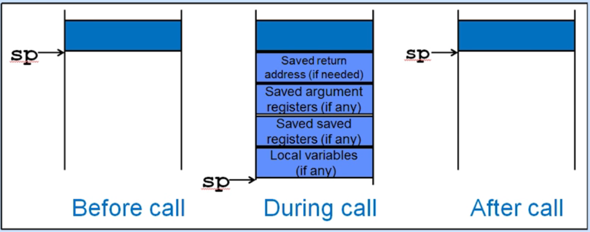
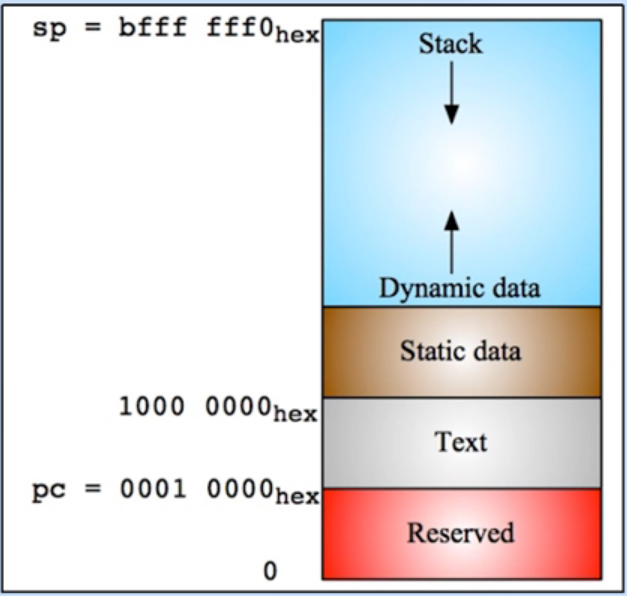

## Stack栈


在函数调用-返回中提到，函数调用-返回的过程分为:

1. 放置传递函数
2. 移交控制权到函数
3. 申请函数的存储空间
4. 执行函数功能
5. 存放结果值、释放存储空间
6. 返回控制权到调用者

从中我们可以看到，在函数调用的过程中的，参数、中间变量、结果值等，需要使用到的寄存器的数量不少。如果函数比较复杂，就需要更多的寄存器来存储了，而这些寄存器可能在函数调用前，可能还保存了原进程中的参变量的值，那么我们如何保存这些原进程中的值，并在返回原进程后还原这些寄存器数值呢？

---

例如C code:

```c
int Leaf(int g ,int h, int i, int j)
{
    int f;
    f = (g + h) - (i + j);
    return f;
}
```

栈是一种后入先出(LIFO)的队列结构，通过压入(push)和弹出(pop)操作，将数据放入或移出栈

栈也是存储器的一部分，因此需要一个指向它的寄存器来保存它的基地址，sp寄存器(x2)就是RISC-V中的栈指针寄存器

我们通常沿着高地址值向低地址值的方向来扩展栈空间，通过递减sp值不断压入(push)数据，通过递增sp值来弹出(pop)数据

一次函数调用中保存在栈中的数据是按一定的顺序组织在一起的，这种组织结构我们称之为**栈帧**

in ASM:

```assembly
Leaf:
		addi sp, sp, -8	#创建两个4字节大小的空间
		sw s1, 4(sp)	#store s1
		sw s0, 0(sp)	#store s0
		
		add s0, a0, a1	#f= g + h
		add s1, a2, a3	#s1 = i + j
		sub s0, s0, s1	#return (g + h) - (i + j)
		
		lw s0, 0(sp)	#restore s0
		lw s1, 4(sp)	#restore s1
		addi sp, sp, 8	#restore sp
		jr ra			#back
```

---

递归函数调用：被调用的函数内部又调用了其他函数时，是否因为新的函数调用而破坏原调用函数中的参数寄存器值a0-a7、以及ra中的返回地址值呢？

C code:

```c
int sumSquare(int x, int y)
{
    return mult(x,x) + y;
}
```

我们需要在调用mult函数前，将存放在ra寄存器中的sumSquare函数的返回地址值先保存起来

我们先了解一下函数调用关系：

1. 在函数调用关系中，我们通常将发起**调用的函数**称之为调用函数caller，将**被调用的函数**称为被调用函数callee
2. 在被调用函数执行结束后返回时，调用函数需要知道在这次函数调用中哪些寄存器的值可能被改过了，哪些寄存器的值需要保证不变
3. 寄存器使用规范：规定函数调用后哪些寄存器能被修改，哪些不能被修改的普遍认同准则
4. **函数调用时保留的寄存器**：被调用的函数一般不会使用这些寄存器，即便使用也会提前保存好原值。**可以信任的寄存器**：sp、gp、tp寄存器和s0-s11寄存器
5. **函数调用时不保存的寄存器**：有可能被调用函数更改的，需要调用函数在调用前对自己用到的寄存器进行保存。寄存器包括：参数与返回值寄存器a0-a7、返回地址寄存器ra、临时寄存器t0-t6

| Register | ABI Name | Description         | Saver  |
| -------- | -------- | ------------------- | ------ |
| x0       | zero     | 硬连线全0           | ---    |
| x1       | ra       | 返回地址寄存器      | Caller |
| x2       | sp       | 栈指针寄存器        | Callee |
| x3       | gp       | 全局寄存器          | ---    |
| x4       | tp       | 线程寄存器          | ---    |
| x5       | t0       | 临时寄存器          | Caller |
| x6-7     | t1-2     | 临时寄存器          | Caller |
| x8       | s0/fp    | 保存/栈帧指针寄存器 | Callee |
| x9       | s1       | 保存寄存器          | Callee |
| x10-11   | a0-1     | 参数/返回值寄存器   | Caller |
| x12-17   | a2-7     | 参数寄存器          | Caller |
| x18-27   | s2-11    | 保存寄存器          | Callee |
| x28-31   | t3-6     | 临时寄存器          | Caller |



依次保存了：原返回地址值，参数寄存器值，保存寄存器值，局部变量值

因此在函数调用中使用栈时：

1. 先减小栈指针(sp)值，开辟出需要的栈空间大小
2. 再将需要保存的寄存器值填入其中(压栈)
3. 在函数调用返回后恢复栈中的寄存器值
4. 恢复栈指针(sp)值，恢复开辟出的栈空间

```assembly
sumSquare:
		addi sp, sp, -8	#space on stack 先减小栈指针(sp)值，开辟出需要的栈空间大小
		sw ra, (0)sp	#save ret addr
		sw a1, (4)sp	#save y			再将需要保存的寄存器值填入其中(压栈)
		
		mv a1, a0		#a1 = x
		jal mult
		
		lw a1, 0(sp)	#restore y
		add a0, a0, a1	#a0 = mult(x) + y
		lw ra, 4(sp)	#restore ra
		addi sp, sp, 8	#restore stack
		jr ra
		
mult:	
		......
```

---

**Memory Allocation:**

- **静态区**中保存的是在程序中只声明一次的全局变量，这部分存储空间只有在程序执行完毕后才会被释放
- **堆区**是程序员使用malloc函数申请的一些动态存储空间，保存一些程序中的动态变量
- **栈区**是程序中发生函数调用时用来保存寄存器值的存储空间

So where is the stack in memory?

栈区从高地址0xbfff_fff0开始向低地址扩展，需要以每16-byte为界进行对齐


